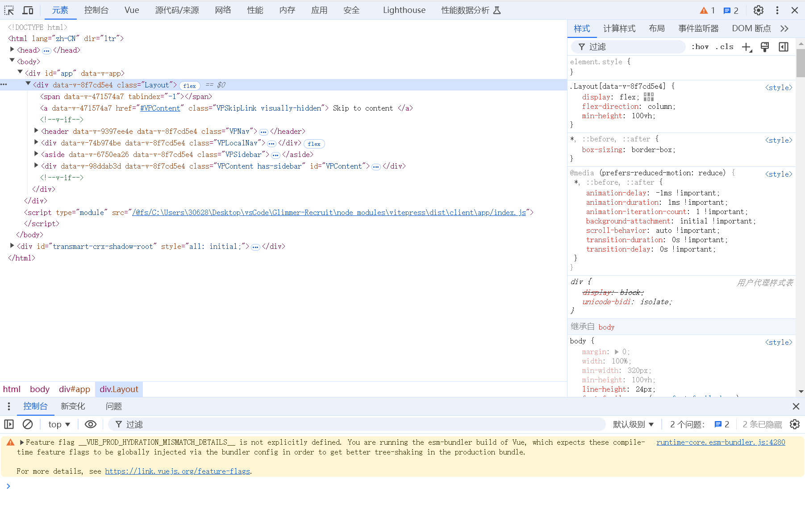

# T1.初识HTML

> ```
> 难度系数：简单
> ```
>
> 相信你已经看过了前端的简介，对前端有了大致的了解。
>
> 或许你还有不少疑惑，但不要着急，都说实践出真知，接下来，我们希望通过一系列的题目，让你先知道我们学些什么，怎么学，以及怎么用，开启前端异世界大门。你需要根据下面的题目指引，完成任务。
>
> 如果遇到不会的，请参考我们提供的教程，大部分往往都会得到解决；同时前端的知识庞大而琐碎，所以需要你边学边做好笔记，以便将来需要用到的时候可以快速检索。当然了，你也可以在题目的底部找到题目的出题人，问问他们或许能找到不少帮助，祝你好运！

## **题目描述**

#### 题目背景

> 你刚刚决定迈入前端的大门，有没有感觉一切都很新奇？神奇的HTML写法、令人眼花缭乱的CSS炫酷样式、让静态页面活起来的JavaScript和各种各样的框架生态......
>
> 不急！让我们从头开始，先试着给自己写一份个人简介，学习一下有关**标签**描述页面元素的方法。
>

#### 任务

**制作个人简介，向我们介绍一下你自己！**

1. 页面标题：显示为“我的简介”

2. 包含主标题

3. 简介需要包含自我介绍与你完成本题的心得

4. 打开你编写的个人简介，使用**开发者工具**添加和修改你的简介内容，截图保存下来，再刷新一下页面，看看发生了什么？

   

**可以添加的内容：**

1. 链接：`<a>` 指向你喜欢的网站
2. 图片：`` 展示一些你喜欢的图片！

**可能的话**，找一找还有哪些**有趣的标签**可以用上？可不可以让你的页面稍微整齐一点？

**本题需要提交代码。**

------

##### **学习攻略**

- 学习和了解什么是HTML标签 （一个基础的 HTML 框架是怎样的，meta 标签 、h1 标签 、div 标签 这些都是什么东西 ? ）

- 学习如何使用F12

- [HTML 教程 | 菜鸟教程](https://www.runoob.com/html/html-tutorial.html) 

- [HTML|MDN ](https://developer.mozilla.org/zh-CN/docs/Web/HTML)
- 其他问题可以参考B站上的视频教程

## **本题提交方式**

> [ 提交点这里 ](https://www.runoob.com/html/html-tutorial.html)

## **出题者Q&A方式**

> QQ：3064517736
>
> 邮箱：[3064517736@qq.com](3064517736@qq.com)