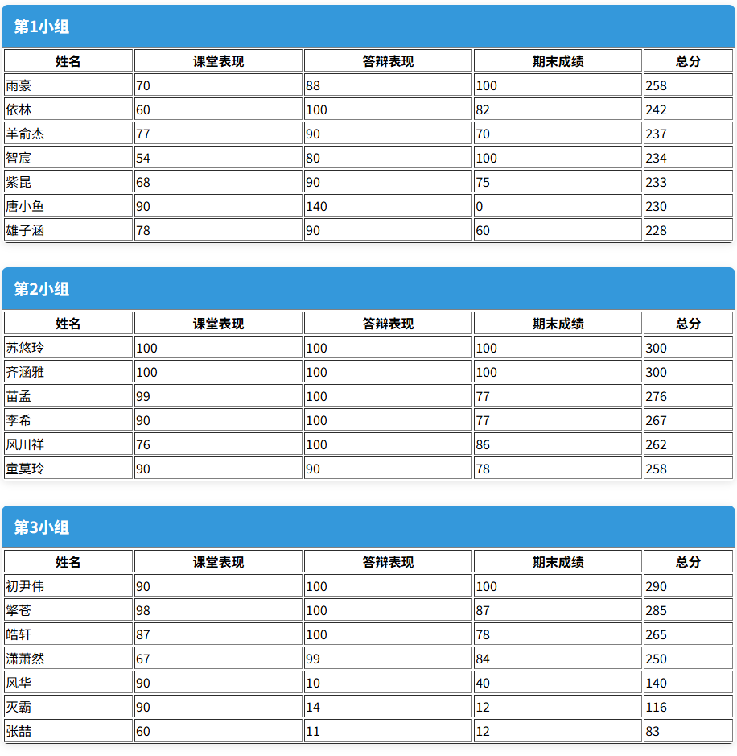

---

prev: 
    text: 'T3.CSS初识'
    link: './T3.CSS初识'

next:
    text: 'T5.制作blog'
    link: './T5.制作blog'

---


# T4.Javascript入门和进阶

> ```
> 难度系数：其实有点难
> ```
>
> 上一题我们了解了前端三剑客之一的CSS，接下来我们将学习前端的最后一块拼图：Javascript。
>
> JavaScript（简称JS）是一种**轻量级、解释型**的编程语言，主要用于构建交互式网页。与CSS的静态实现不同，它能让静态页面“动起来”，实现动态内容更新、用户交互、动画效果等核心功能。

## **任务：**

在完成题目之前，你需要认真学习有关**Js的核心语法**和**ES6/ES7语法规范**（即ECMAScript，JavaScript的标准化版本，引入了许多新特性，使JS更加强大和现代化）。在这个过程中，你不得不花上1-2周时间提前学习有关js的语法和规范，对于前端的学习来说，基础是一切，框架变了又变、语法糖一新再新的当下，没有什么比打好基础更重要。

##### 1.**你需要初步了解JS的：**

- **作用域**
- **闭包**
- **原型链**
- **异步编程**

##### 2.**还需要进一步学习ES6/ES7的特性，比如：**

- **变量声明的变化**
- **某些数据结构（什么是对象？）**
- **箭头函数**
- **模板字符串**
- **解构赋值**
- **模块化开发（了解）**

**3.进阶：DOM和BOM操作方法**

> 初步学习后可以去了解一下jQuery，作为一个dom操作库还是很优秀的，简单易上手，而且可以学到很多常见的dom操作方法。

**推荐教程：**[Javascript | 菜鸟教程](https://www.runoob.com/js/js-tutorial.html)

**推荐视频教程：**[JS基础语法教程（包含ES6和ES7的特性）| bilibili 峰华工程师 ](https://www.bilibili.com/video/BV1P741147CT/?share_source=copy_web&vd_source=6da714985b7d49750851fb43c0236124) 和 [ES6规范 零基础入门 | bilibili 蔡蔡小趴菜](https://www.bilibili.com/video/BV1vm2dY3EBW/?share_source=copy_web&vd_source=6da714985b7d49750851fb43c0236124)

在完成上述任务之后，相信你对前端的js部分已经有了初步的认识与了解，试着完成以下题目吧！

------

### 实战题目

> 背景概要：小鱼和雨捷在本学期同时选择了“能治工人时代”必修课的文曲星老师，在期末成绩出来时，文曲星老师希望看到各个小组的得分情况，以便统计小组的分数情况。然而在学校给的名单里，不同小组的学生混杂在一起，想要统计起来很是麻烦。于是她找到了两位同学，委托他们把班里的学生成绩先按组分好，再按照总分由高到低排下来，还许诺两位同学以加分作为报酬！

现在他们找到了你，希望你能为他们解决这个难题：

题目文件目录结构如下：

```
├── index.html
└── index.js
```

其中index.html是主页面，index.js是待补充的js文件，你需要完成其中的“Todo”部分，并让页面最终呈现以下效果：（初始状态页面为什么会显示空白呢？）



排序规则：

- 主排序：按总分降序排列
- 次排序：无要求，你可以自由发挥。

> ### [本题文件点此下载](/frontend-T4-1.zip)  

提示：

1.你需要返回一个对象，键是什么？值是什么？

2.用markdown记录下你的做题心得，与本题代码一起提交

## **本题提交方式**

> [ 提交点这里 ](https://www.runoob.com/html/html-tutorial.html)


## **出题者Q&A方式**

> QQ：3064517736
>
> 邮箱：[3064517736@qq.com](3064517736@qq.com)

